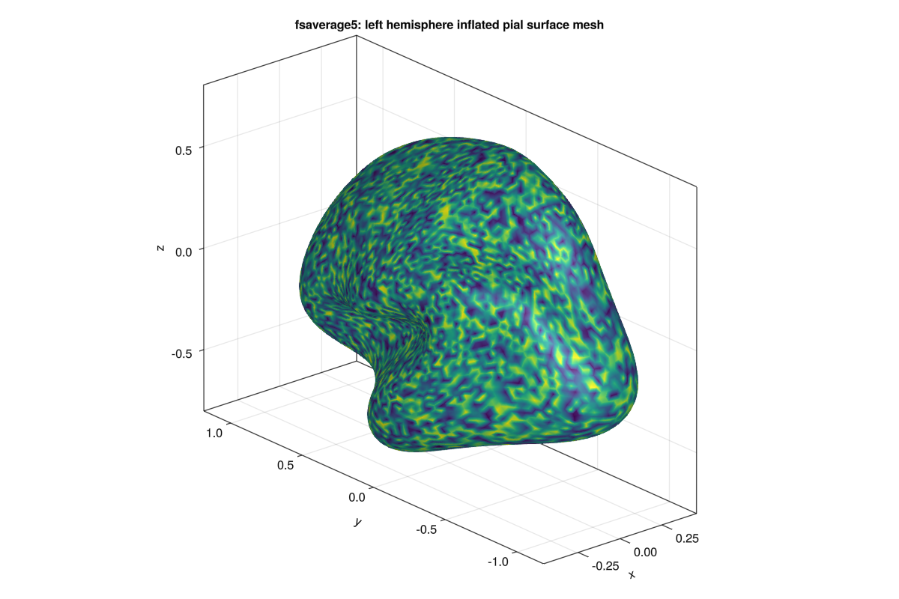

# GIFTI

This package includes very basic support for loading GIFTI (`.gii`, `.gii.gz`) files in Julia. Currently only the surface mesh can be extracted, represented as a `Mesh` from [GeometryBasics.jl](https://github.com/JuliaGeometry/GeometryBasics.jl).

## Usage Example

```julia
using GIFTI
using GLMakie
using GeometryBasics

# Load Mesh
example_mesh = GIFTI.load(GIFTI.assetpath("infl_left.gii.gz"))

# Visualize via Makie
f = Figure(backgroundcolor=RGBf(1, 1, 1),resolution=(1200, 800))
ax = Axis3(f[1, 1], title="fsaverage5: left hemisphere inflated pial surface mesh", aspect=:data)
mesh!(ax, example_mesh, color=rand(length(coordinates(example_mesh))))
f
```


